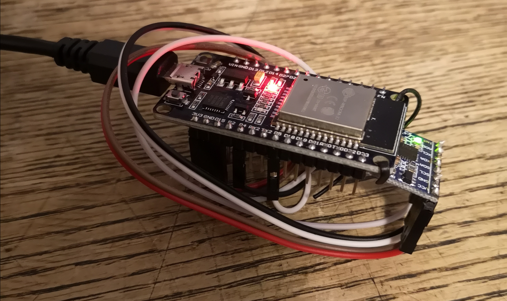

# ESP32-Firmware
Firmware for the ESP32 rev of the Bluetooth OpenVBT

## Hardware needed:

- ESP32 Wrover Dev board ($15 USD - https://www.adafruit.com/product/3269)
- MPU6050 breakout board ($6.95 USD - https://www.adafruit.com/product/3886)
- LiPo or LiFePO4 battery to run without USB - must be at least 5V
- Jumper cables

*Assembled OpenVBT prototype*

## Current firmware status:

- Accurate readings from MPU6050 IMU (will require individual calibration)
- Rep detection algorithm with minimal false positives or negatives
